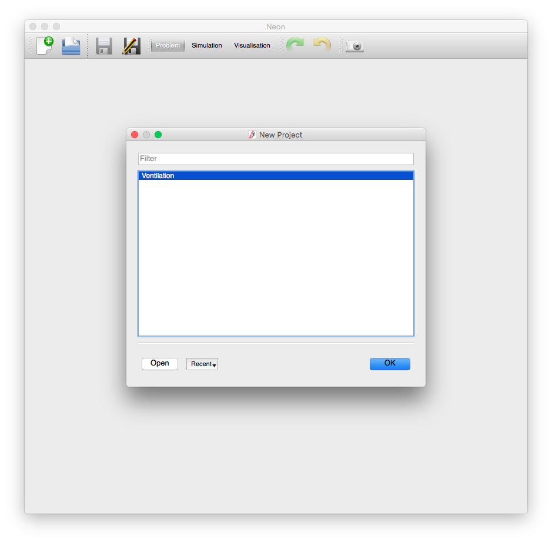
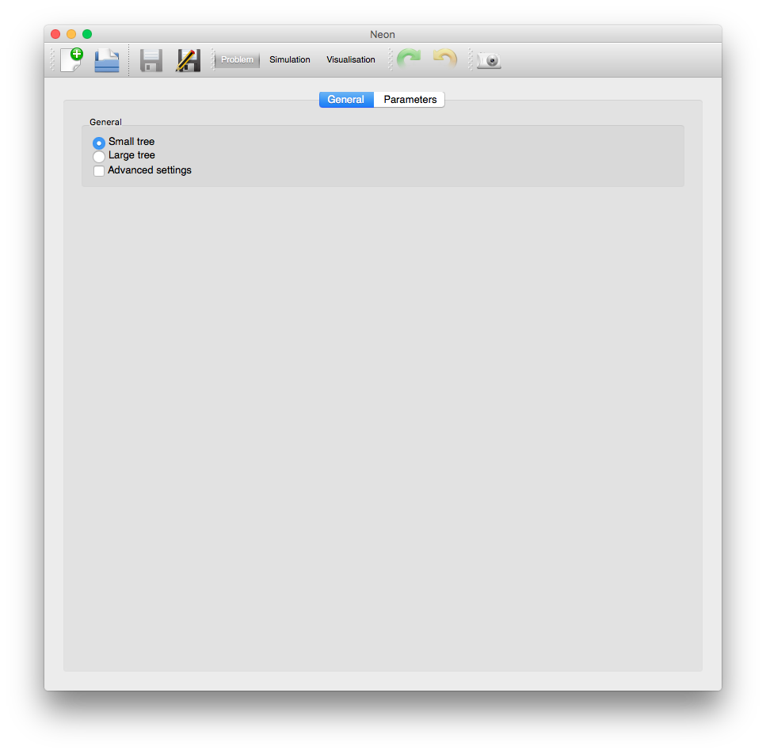
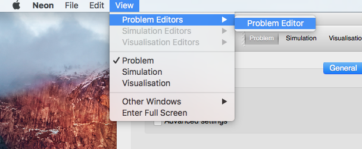
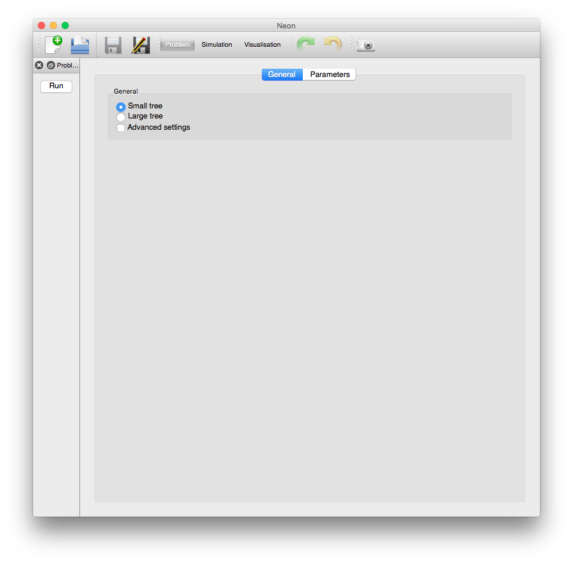
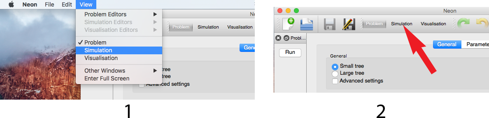
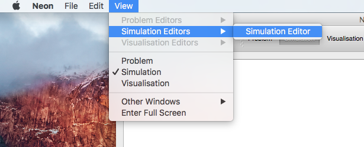
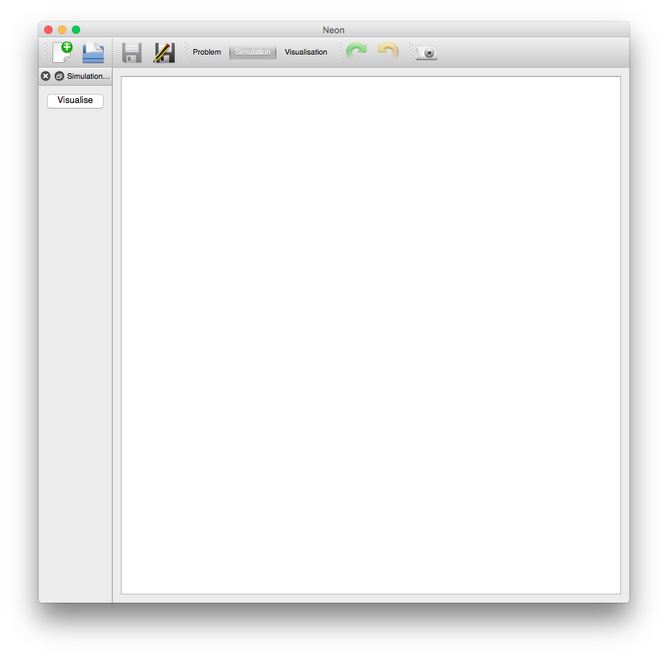

==============
First Time Use
==============

The first time the Neon application is run it sets the application up using the default settings.  The current default settings are a bit unintuitive, so the first task is to setup a more intuitive environment for modelling.  Once the application has been run once the application settings are saved and subsequent launches will not require the following actions.

The very first time that Neon is launched the following screen is presented:

   The application screen on startup for the very first time.
   
For this version of the application there is only one project to select, and that is the *ventilation* project.  Double-click on the *Ventilation* item in the list or click the *OK* button.  

-------------------------
Setup Application for Use
-------------------------

Now that the project is chosen (Ok so not much of a choice currently) the *Problem* screen is shown (:numref:`first_time_problem`).  On this screen we can set the parameters for the problem we are going to run.  For the *Ventilation* problem we can set some *General* settings, either a large or small lung model and we are able to set the *Parameters* for the simulation via the *Parameters* tab.

.. _first_time_problem:

   The problem screen on startup for the very first time.
   
But before we get into changing parameters we will prepare the application for further use.  For the :guilabel:`Problem` screen we need to make the :guilabel:`Run` button visible so that we can run the problem.  To do this use the :guilabel:`View` menu to open the :guilabel:`Problem Editor` dialog (complete menu path :menuselection:`View --> Problem Editors --> Problem Editor`, (see :numref:`first_time_problem_show_run`)).

.. _first_time_problem_show_run:

   The Menu navigation for showing the :guilabel:`Problem Editor` dialog.
   
Once the :guilabel:`Problem Editor` is shown the :guilabel:`Problem` screen should be similar to :numref:`first_time_problem_with_run`

.. _first_time_problem_with_run:

   The :guilabel:`Problem` screen with the :guilabel:`Problem Editor` visible.

Next we will perform a similar action with the :guilabel:`Simulation` screen.  We can change to the :guilabel:`Simulation` screen in one of two ways:

 1. Through the :guilabel:`View` menu :menuselection:`View --> Simulation`.
 2. Through the :guilabel:`View Toolbar` :guilabel:`Simulation` button.

both of these options can be seen in :numref:`first_time_problem_change_to_simulation`.

.. _first_time_problem_change_to_simulation:

   The :guilabel:`Problem` screen with the :guilabel:`Problem Editor` visible.

We should note here that when we :guilabel:`Run` a problem we will also transition to the :guilabel:`Simulation` screen once the simulation commences.

To make the :guilabel:`Visualise` button visible so that we can visualise the problem and simulation results we need to show the :guilabel:`Simulation Editor`.  As mentioned earlier this is done in a similar manner to making the :guilabel:`Problem Editor` visible.  The initial visibility of the :guilabel:`Simulation Editor` dialog can be accessed through the :guilabel:`View` menu (complete path :menuselection:`View --> Simulation Editors --> Simulation Editor`, (see also :numref:`first_time_simulation_show_visualise`)).

.. _first_time_simulation_show_visualise:

   The Menu navigation for showing the :guilabel:`Simulation Editor` dialog.
   
When the :guilabel:`Simulation Editor` is shown the :guilabel:`Simulation` screen should be similar to :numref:`first_time_simulation_with_visualise`

.. _first_time_simulation_with_visualise:

   The :guilabel:`Simulation` screen with the :guilabel:`Simulation Editor` visible.

The application is now ready to start being used in earnest.  Go back to the :guilabel:`Problem` screen (through either :menuselection:`View --> Problem` or :guilabel:`View Toolbar` :guilabel:`Problem` button) and read the section on :ref:`configuring_ventilation_section_label`.

