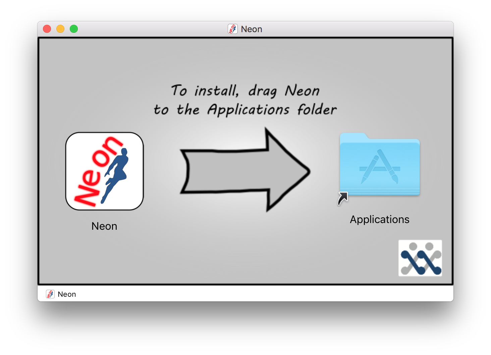

=======
Install
=======

To install Neon for your platform see the appropriate subheading below.

OS X
====

.DMG
----

To install Neon using the Neon.dmg file, double click the .dmg to make it's contents available.  The following window should appear:

   The Neon.dmg installer window.
   
As the instructions show in the installer window, drag the Neon.dmg icon on top of the *Applications* folder icon.  This may require an administrator's password.  This action will result in the application being copied into the *Applications* folder, wait for the copy process to finish.  Once the copy is complete eject the Neon.dmg and delete the Neon.dmg file.

.ZIP
----

To install Neon using the Neon.zip file, double click the .zip file to extract it in the current folder.  Once the extraction from the .zip archive is complete delete the Neon.zip file.

Windows
=======

.EXE
----

To install Neon using the executable installer, double click on the .exe to start the installation wizard.  Follow the on-screen instructions to install the application.

.ZIP
----

To install Neon using the .zip file, double click the .zip file to open a file explorer window.  Drag, copy, or cut the *dist* directory out of the zip file and onto the *Desktop* (or somewhere similar).

GNU/Linux
=========

No installation instructions are currently available for this platform.

